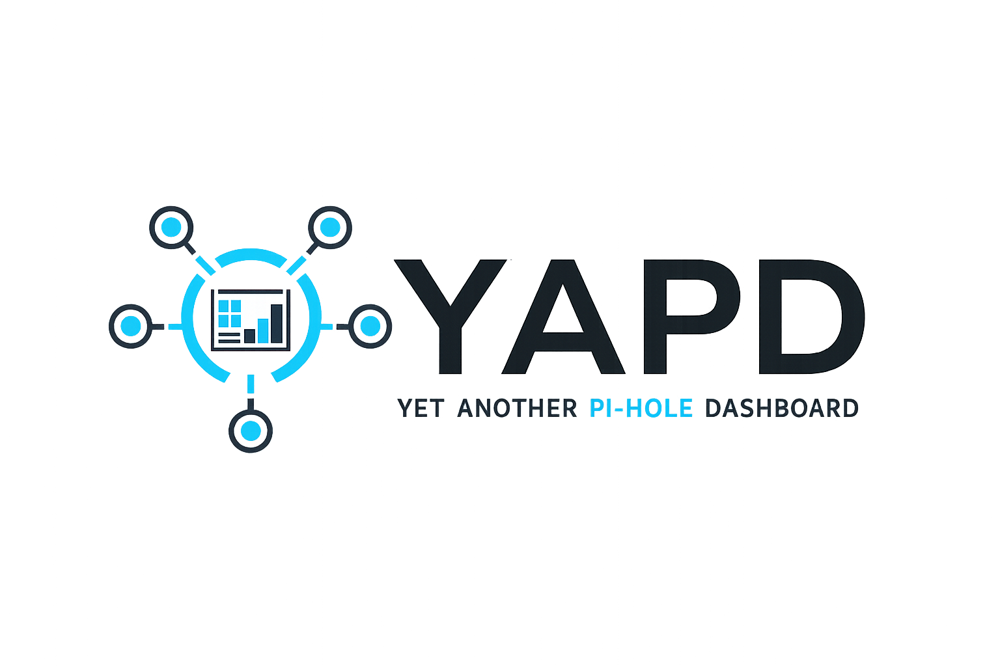
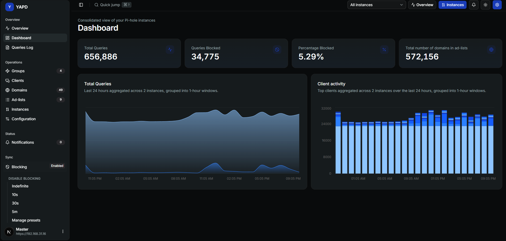
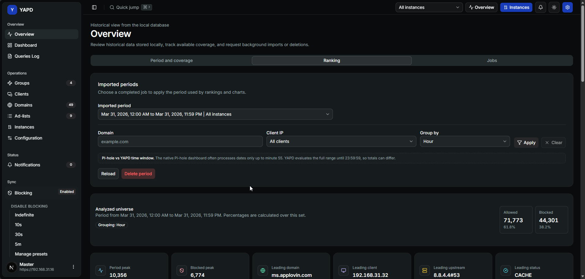
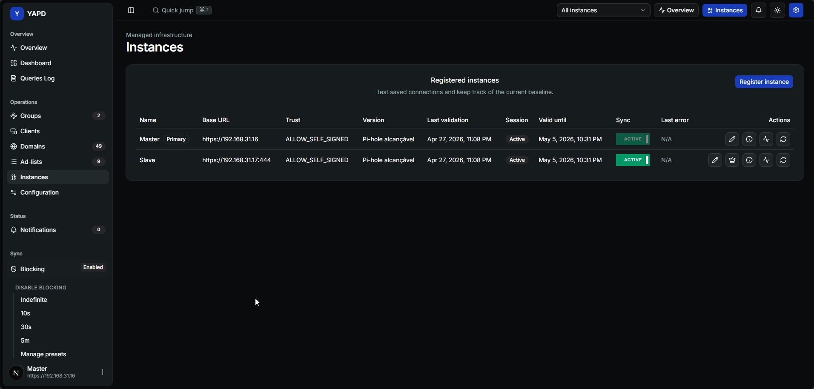
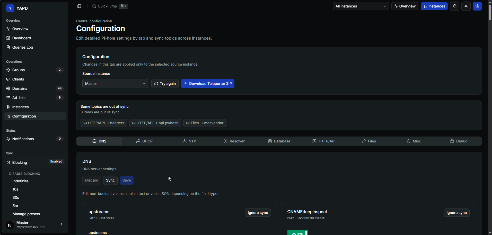
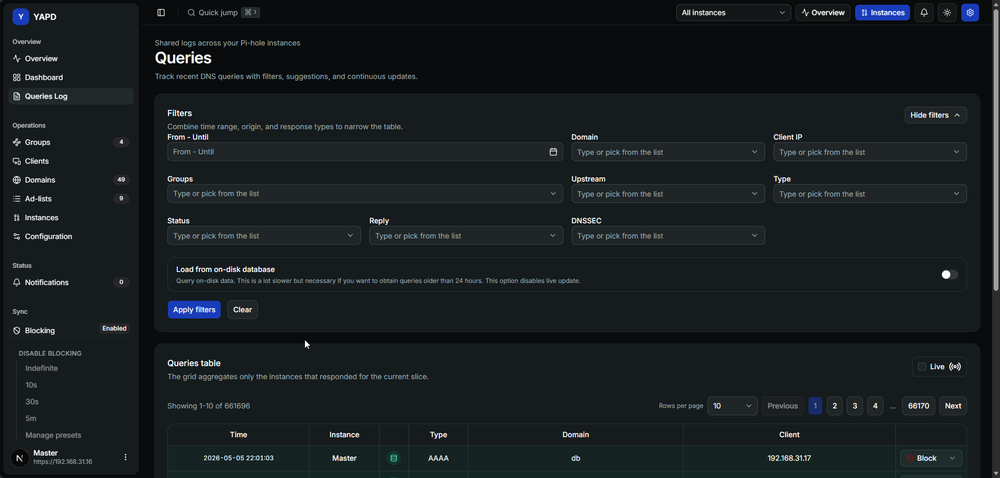
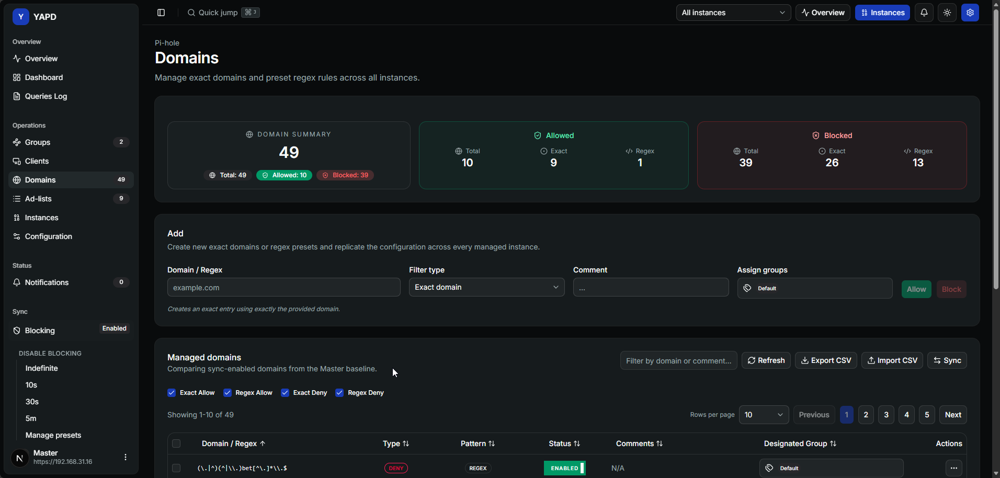
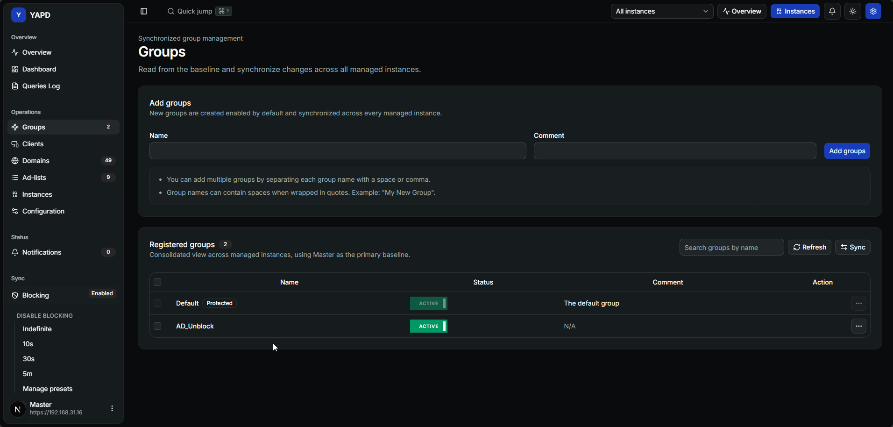
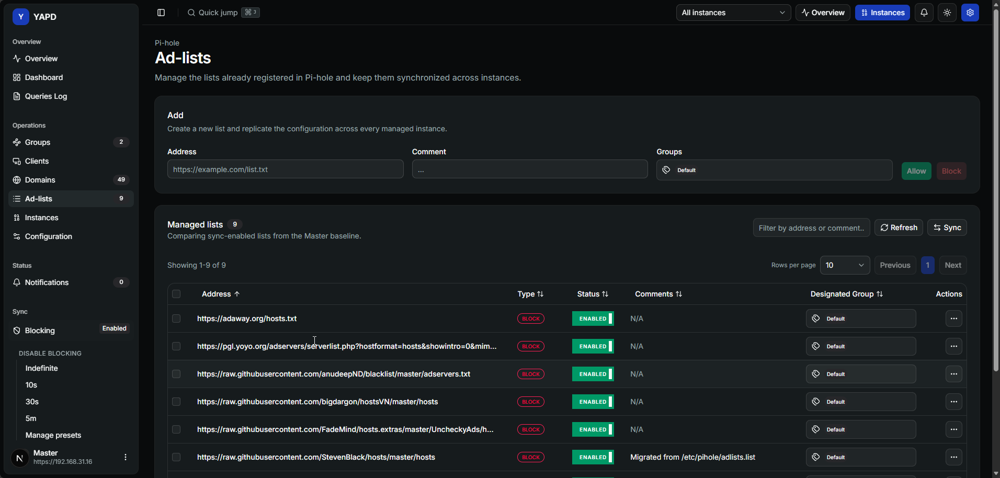
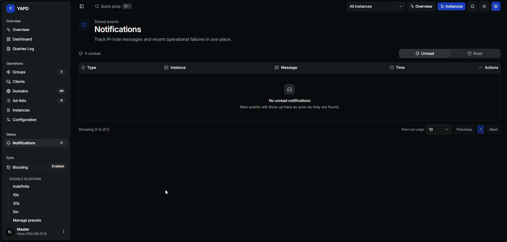

<p align="center">
  
</p>

# YAPD

**Yet Another Pi-hole Dashboard** é uma central auto-hospedada para quem usa mais de uma instância do Pi-hole e quer uma forma mais clara e segura de acompanhar a rede.

O YAPD foi pensado para reunir ambientes Pi-hole v6+ em um único lugar: painéis, saúde das instâncias, consultas DNS, gerenciamento de configuração, sincronização, detecção de divergências, histórico de auditoria e futuros controles parentais. Em vez de abrir cada Pi-hole separadamente, o YAPD busca ser a superfície operacional confiável para todo o seu ambiente de filtragem DNS.

Se você usa Pi-hole em casa, em um homelab ou em uma pequena rede, o YAPD é o tipo de ferramenta que vale testar cedo, quebrar com honestidade e ajudar a melhorar. Relatos de bug, feedback de usabilidade, ideias de funcionalidades e observações de deploy real vão ajudar a moldar o projeto.

## Por Que O YAPD Existe

Rodar um único Pi-hole é simples. Rodar várias instâncias em um homelab, escritório pequeno, rede com VLANs ou ambiente familiar exige mais cuidado:

- configurações podem ficar diferentes entre instâncias;
- mudanças importantes podem passar despercebidas;
- a atividade DNS fica espalhada em dashboards diferentes;
- sincronizações manuais podem ser arriscadas;
- ações críticas precisam de histórico visível.

O YAPD parte de uma ideia simples: **o dashboard deve conhecer o estado desejado, mostrar quando a realidade está diferente e tornar mudanças explícitas, auditáveis e recuperáveis**.

## Destaques

- **Dashboard multi-instância**: gerencie e monitore várias instâncias Pi-hole v6+ em uma única interface.
- **Configuração central como fonte da verdade**: mantenha o estado esperado no YAPD em vez de depender de ajustes manuais espalhados.
- **Sincronização e detecção de drift**: identifique quando uma instância diverge do estado esperado antes de aplicar mudanças.
- **Visibilidade de consultas e atividade**: acompanhe atividade DNS, clientes, domínios e histórico pela tela de Overview.
- **Saúde das instâncias e alertas**: veja status operacional, notificações e pontos que precisam de atenção.
- **Operações com auditoria**: registre ações críticas, mudanças de configuração, tentativas de sync e eventos sensíveis.
- **Direção security-first**: projetado para LAN/VPN, segredos criptografados, sessões seguras, trust explícito para certificados self-signed e sem credencial padrão fixa.
- **Internacionalização**: o projeto é pensado para usuários em português do Brasil e inglês.

## O Que Você Pode Fazer Com O YAPD

O YAPD está sendo construído como um dashboard operacional para a administração diária do Pi-hole:

- **Ver o ambiente DNS de uma vez**: abra um único dashboard para entender tráfego, atividade de bloqueio, status das instâncias e eventos operacionais recentes.
- **Explorar o histórico de consultas**: use as telas Overview e Consultas para inspecionar domínios, clientes, requisições bloqueadas e padrões de atividade sem alternar entre instâncias Pi-hole.
- **Gerenciar objetos do Pi-hole de forma centralizada**: revise e organize domínios, grupos, listas de bloqueio e áreas de configuração em uma interface unificada.
- **Comparar instâncias antes de aplicar mudanças**: identifique divergências de configuração e entenda qual instância está fora de sincronia antes de executar uma alteração sensível.
- **Preparar fluxos de sincronização mais seguros**: use um estado desejado central, pré-checagens, retries e reconciliação explícita em vez de edições manuais uma a uma.
- **Acompanhar o que mudou**: mantenha ações críticas visíveis por registros orientados a auditoria, notificações e histórico futuro de jobs.
- **Evoluir para controles parentais**: o roadmap v1 inclui associação de clientes a perfis, janelas de bloqueio agendadas e uma visão parental dedicada.
- **Operar com confiança em redes privadas**: o YAPD é pensado para deploys LAN/VPN, mantendo limites de segurança dentro da própria aplicação.

O projeto ainda está evoluindo. Se uma tela parecer confusa, se um fluxo estiver faltando ou se o seu setup Pi-hole revelar um caso inesperado, abra uma issue e descreva o que aconteceu. As melhores melhorias virão de usuários reais operando redes reais.

## Prints

### Dashboard



### Overview



### Instâncias



### Configuração



### Consultas



### Domínios



### Grupos



### Listas De Bloqueio



### Notificações



## Arquitetura Em Linguagem Simples

O YAPD é um monorepo TypeScript com uma aplicação web, uma API e um cliente de API gerado.

- **Frontend**: Next.js App Router, Tailwind CSS, Shadcn UI, Zustand e `next-intl`.
- **Backend**: API NestJS com Prisma e PostgreSQL.
- **Cliente de API**: cliente TypeScript gerado e usado pelo frontend.
- **Realtime**: direção para eventos via WebSocket, como jobs de sincronização, alertas e saúde de instâncias.

O frontend não deve ser o lugar das regras sensíveis. O backend concentra autenticação, integração com Pi-hole, sincronização, detecção de drift, auditoria, notificações e ações críticas.

## Créditos

A UI do dashboard do YAPD começou a partir do excelente projeto [next-shadcn-admin-dashboard](https://github.com/arhamkhnz/next-shadcn-admin-dashboard), de Arham Khan. O YAPD adapta essa base visual para um produto focado em Pi-hole, com backend, modelo de domínio, fluxos e direção de segurança próprios.

## Segurança E Deploy

O YAPD foi projetado primeiro para redes privadas confiáveis, como ambientes **LAN ou VPN**. Um proxy reverso pode ser usado, mas não deve substituir os controles da própria aplicação.

A direção da v1 inclui:

- sessões administrativas seguras com cookies HTTP-only;
- hashing forte de senha;
- rate limit e lockout para fluxos sensíveis;
- credenciais Pi-hole e segredos da aplicação criptografados;
- trust explícito para certificados self-signed de instâncias Pi-hole;
- auditoria para operações críticas;
- reautenticação para ações perigosas;
- nenhum admin padrão estático ou senha bootstrap hardcoded.

## Início Rápido Para Desenvolvimento

```bash
npm install
npm run db:up
npm run prisma:generate
npm run generate:api-client
npm run dev
```

Comandos úteis de validação:

```bash
npm run check
npm run lint
npm run build
```

Para mudanças no schema do banco, use migrações Prisma em `apps/api/prisma/migrations`:

```bash
npm run db:migrate:dev -- --name your_change_name
```

Evite `prisma db push` para mudanças de schema da aplicação. As migrações são a fonte da verdade para evoluções seguras em desenvolvimento e produção.

## Bugs Conhecidos E Ajuda Necessária

O YAPD ainda é jovem, e setups de rede reais são a melhor forma de encontrar pontos frágeis. Se você encontrar um destes problemas, abra uma issue com logs, versão do Pi-hole, versão ou commit do YAPD, forma de deploy e o que fez o sistema se recuperar.

- **Alcance intermitente de instâncias Pi-hole**: o YAPD pode às vezes perder conexão com uma instância Pi-hole, não conseguir localizá-la ou mostrar rapidamente um aviso de inalcançável. Em alguns casos a instância se recupera logo depois sem reinício manual. Ajuda é bem-vinda aqui: uma boa correção deve explicar a causa raiz, como a solução diferencia falhas temporárias de rede ou health-check de uma indisponibilidade real, e como a UI deve informar a recuperação sem esconder um problema verdadeiro.

## Status Do Projeto

O YAPD está em desenvolvimento ativo rumo ao plano v1 descrito em [Plano.md](../Plano.md). O objetivo é entregar um dashboard prático, auto-hospedado e consciente de segurança para operar instalações Pi-hole com mais confiança e menos trabalho manual repetitivo.
